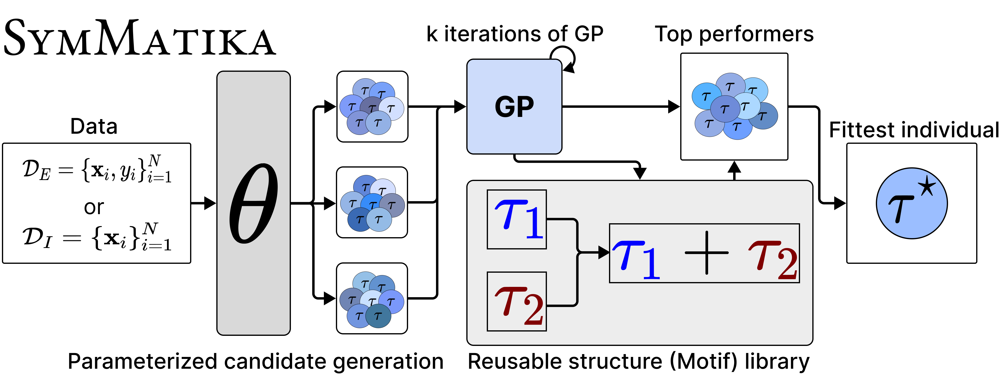
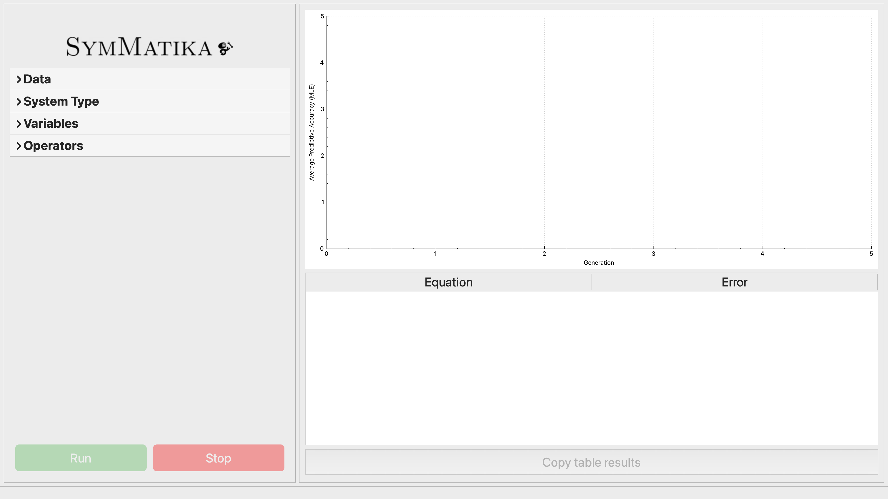
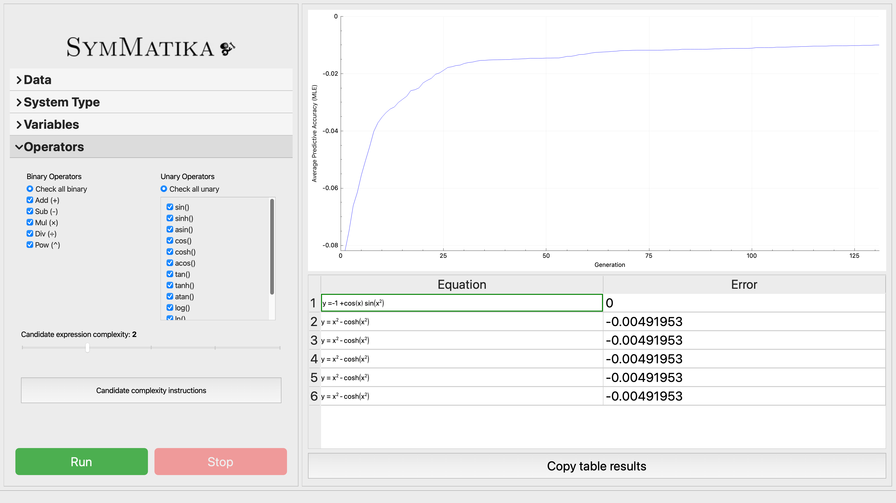

# SymMatika: Structure-Aware Symbolic Discovery

[Michael Scherk](https://www.linkedin.com/in/michael-scherk/), [Boyuan Chen](http://boyuanchen.com)
<br>
Duke University
</br>

<p align="center">
     
</p>

[Website](http://www.generalroboticslab.com/blogs/blog/2025-07-04-symmatika/index.html) | [Paper](https://arxiv.org/abs/2507.03110) | [Video](https://www.youtube.com/watch?v=rVUUj_WSLWo&t=5s)

**SymMatika** discovers symbolic expressions from data, which manifest as either *explicit* mappings like `y=f(x₁, x₂, ...)` or implicit physical invariants. We provide our full codebase here for running-with-code use (including an executable terminal option to run directly from the terminal without any coding) and a user-friendly GUI. Both installations and use instructions are available on this page.

## Contents
- [Installation](#installation)
- [Instructions](#instructions)
- [Running](#running)

## Project Structure
```
.
├── CMakeLists.txt
├── README.md
├── cmake
│   ├── dependencies.cmake
│   └── optimizations.cmake
├── evolution
│   ├── genetic_algorithm.cpp
│   ├── genetic_algorithm.h
│   ├── genetic_operations.cpp
│   ├── genetic_operations.h
│   ├── motif_finder.cpp
│   └── motif_finder.h
├── figures
│   ├── ModelOverview.jpg
│   ├── SymMatikaEndScreen.png
│   ├── SymMatikaOpenScreen.png
│   └── SymMatikaTerminalGuide.gif
├── fitness_core
│   ├── differentiation.cpp
│   ├── differentiation.h
│   ├── evaluate_tree.cpp
│   ├── evaluate_tree.h
│   ├── fitness.cpp
│   └── fitness.h
├── initialize_model.cpp
├── initialize_model.h
├── main.cpp
├── model.cpp
├── model.h
└── tree_construction
    ├── build_candidates.cpp
    ├── build_candidates.h
    ├── generate_population.cpp
    └── generate_population.h
```

## Installation
Some basic pre-requisites include: a C++23-compatible compiler and a MacOS or Windows machine (`Homebrew` recommended for MacOS; `vcpkg` recommended for Windows). If you haven't yet, install [Homebrew](https://brew.sh) or [vcpkg](https://vcpkg.io/en/index.html). We use the C/C++ Homebrew compilers for MacOS or [Chocolatey](https://docs.chocolatey.org/en-us/choco/setup/) compilers for Windows. Then install the packages below.
```
# For MacOS Homebrew
brew install cmake symengine llvm gmp mpfr libmpc flint libomp eigen ghostscript        # ghostscript only needed for GUI latex rendering

# For Windows vcpkg
.\vcpkg install symengine gmp mpfr libmpc flint eigen3 ghostscript                      # ghostscript only needed for GUI latex rendering
choco install llvm
```
Once the previous steps are completed, clone and build.
```
git clone https://github.com/generalroboticslab/SymMatika

mkdir build
cd build
cmake .. -DCMAKE_CXX_COMPILER=$(brew --prefix llvm)/bin/clang++
cmake --build .
```

## Instructions
For setting up SymMatika to run locally, first open an IDE with C++23 support (SymMatika was developed with [CLion](https://www.jetbrains.com/clion/download/?section=mac#), so we **strongly recommend** you choose this IDE) and point the IDE to Homebrew C/C++ compilers (`/opt/homebrew/opt/llvm/bin/clang` and `/opt/homebrew/opt/llvm/bin/clang++` are compiler paths) or Chocolatey C/C++ compilers (`C:\Program Files\LLVM\bin\clang-cl.exe`).
- for CLion, do: CLion &rarr; Settings &rarr; Toolchains, and then update the C/C++ Compiler fields
- for VSCode, ensure your `c_cpp_properties.json` file looks like:
```cpp
// for MacOS
{
    "configurations": [
        {
            "name": "Mac",
            "includePath": [
                "${workspaceFolder}/**",
                "/opt/homebrew/opt/symengine",
                "/opt/homebrew/opt/eigen/include/eigen3",
                "/opt/homebrew/opt/libomp/include",
                "/opt/homebrew/include"
            ],
            "defines": [],
            "compilerPath": "/opt/homebrew/opt/llvm/bin/clang",
            "cStandard": "c17",
            "cppStandard": "c++23",
            "intelliSenseMode": "macos-clang-arm64"
        }
    ],
    "version": 4
}

// for Windows
{
  "version": 4,
  "configurations": [
    {
      "name": "Win-Clang",
      "includePath": [
        "${workspaceFolder}/**",
        "C:/vcpkg/installed/x64-windows/include",
        "C:/vcpkg/installed/x64-windows/include/symengine",
        "C:/vcpkg/installed/x64-windows/include/eigen3",
        "C:/vcpkg/installed/x64-windows/include/libomp"
      ],
      "defines": [
        "_WIN32",
        "_OPENMP"
      ],
      "compilerPath": "C:/Program Files/LLVM/bin/clang-cl.exe",
      "cStandard": "c17",
      "cppStandard": "c++23",
      "intelliSenseMode": "windows-clang-x64"
    }
  ]
}
```
- open the SymMatika directory you previously installed in [installation](#installation)

We outline the following instructions for valid dataset files:
- files must be `.txt` or `.csv`
- when searching for explicit mappings (i.e. some *f* s.t. *f(x_1, ... , x_n) = y* for input variables *x_1, ... , x_n* and target variable *y*), the last column must be the target variable and the previous columns are inputs
- when searching for implicit relations (i.e. no known target variable, common in discovering physical invariants), the first column is the trial number (i.e. 1 or 2), the second column is time, and the subsequent columns correspond to variables

To ensure fast runtimes, we recommend using datasets with < 10,000 samples, as runtimes scale massively with large datasets. This is not a requirement, but merely a suggestion. For discovering implicit relations, we can only support discovery in physical systems of up to four variables.

## Running
We provide three methods of using SymMatika, one with code and two alternative methods:
- [Code](#code)
- [Terminal](#terminal)
- [GUI](#GUI)

### Code
To run the model with code, navigate to the `main.cpp` file. Once there, you can initialize a `DataSet` object by calling the following:
```cpp
#include <iostream>
#include "model.h"

int main() {
    // Explicit dataset
    DataSet data = DataSet(
        "/Users/generaroboticslab/Desktop/SymMatika/example_data/sine_data.csv", // path to CSV file
        true,                                                                    // true = explicit mapping (y = f(x))
        {"x", "y"}                                                               // input: x, target: y
    );

    // Run symbolic regression model
    Model symMatika = Model(
        data,
        10000,                               // population size
        3,                                   // max tree depth
        {true, true, true, true, true, true} // enable all operations
    );

    symMatika.run();
    return 0;
}
```
> 💡 **Tip:** For easy file access, place the `.txt`/`.csv` file in `cmake-build-debug` and just pass the filename

### Constructor Reference
```cpp
DataSet data = DataSet(fileName, systemType, variableList);
```
- `filename` = string name of path to data file, place in `cmake-build-debug` folder for easiest access
- `systemType` = True is *explicit* and False is *implicit*
- `variableList` = string vector of input variable names, and a target variable as the last element in the vector if *explicit* `systemType`

```cpp
Model symMatika = Model(data, popSize, maxDepth, allowedOps);
```
- `popSize` = initial starting populations for each island population (recommended 10,000)
- `maxDepth` = maximum depth of binary expression trees; in range of 1-5 in ascending candidate expression complexity
- `allowedOps` = vector of boolean values for each binary and unary operator, True for enable and False for disable (by default, all operators are enabled)
> 💡 **Tip:** To ensure fast runtimes, we recommend using datasets with < 10,000 samples, as runtimes scale massively with large datasets. This is not a requirement, but merely a suggestion. For discovering implicit relations, we can only support discovery in physical systems of up to four variables.

### Terminal
Instead of manually coding, we offer an alternative solution for users to easily run SymMatika in the terminal. For running through terminal, navigate to `main.cpp` in the SymMatika project and uncomment the function call to `easy_run()`:
```cpp
int main() {

    /* INSTRUCTIONS for INSTALLATION are found in the GitHub
     * documentation
     *   - to easily run the model in the terminal, uncomment
     *     the function call to 'easy_run()'
     *
     * Also, make sure to have the data files in the CMAKE-BUILD-DEBUG
     * folder for easiest use. If this folder isn't present, simply
     * reload the CMake project by: File -> Reload CMake Project
     */

    // easy_run();

    return 0;
}
```
Then run the program, and follow the instructions in the terminal. SymMatika outputs a LaTeX table of top-solutions and their corresponding predictive errors. We provide a short demonstration below:

<p align="center">
  
</p>

### GUI
We offer a user-friendly GUI for SymMatika. Qt Creator must be used for local use, which can be installed for free at [this website](https://www.qt.io/download-qt-installer-oss). To download, navigate to the Releases tab on the SymMatika GitHub home page. Click the *SymMatika GUI Download* release and download the `.zip` file. Once downloaded, unzip it and then open Qt Creator. Before you open and run the GUI, ensure that you reload `cmake-build-debug` for the `SymMatika_Engine` subdirectory in the downloaded `.zip` folder; this can be done by opening your IDE and pressing `Reload Cmake Project`. Click *Open Project* in the Welcome tab then navigate to and open the `CMakeLists.txt` in the root directory. The program will take some time (~5 minutes) to build, since it has external C++ dependencies for tasks such as LaTeX rendering. Once the project is built, click run and open the MainWindow.

<p align="center">
     
</p>

Once open, begin by clicking the Data header and upload the data file (recall the file instructions). Then, click the System Type header and check *explicit mappings* or *implicit relations*. Go to Variables and add the input variables and optionally the target variable. Then, select binary and unary operators and customize the complexity of generated candidate expressions.

<p align="center">
     
</p>

After the model runs, press the "Copy table results" button to copy a LaTeX table of top-solutions and their corresponding predictive errors.

## Acknowledgements
This work is supported by ARO under award W911NF2410405, DARPA FoundSci program under award HR00112490372, DARPA TIAMAT program under award HR00112490419, and by gift support from BMW and OpenAI.

## Citation
If you found our paper or codebase to be helpful, please consider citing our work:
```
@misc{scherk2025symmatikastructureawaresymbolicdiscovery,
      title={SymMatika: Structure-Aware Symbolic Discovery}, 
      author={Michael Scherk and Boyuan Chen},
      year={2025},
      eprint={2507.03110},
      archivePrefix={arXiv},
      primaryClass={cs.LG},
      url={https://arxiv.org/abs/2507.03110}, 
}
```
